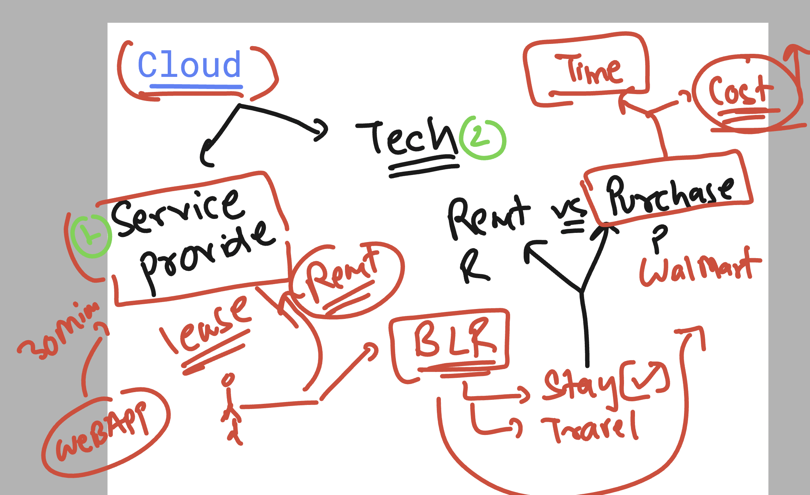
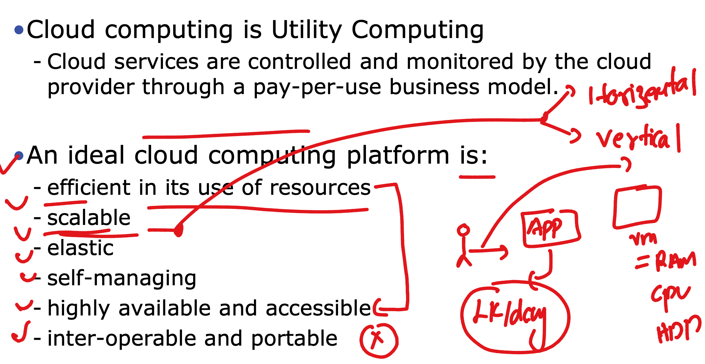
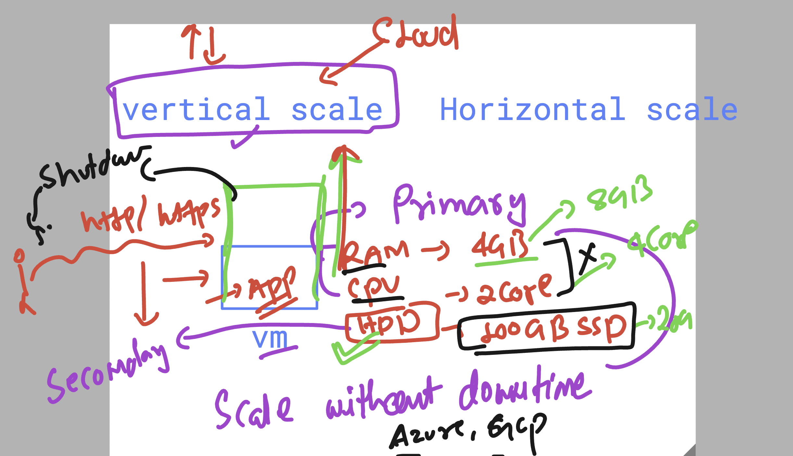
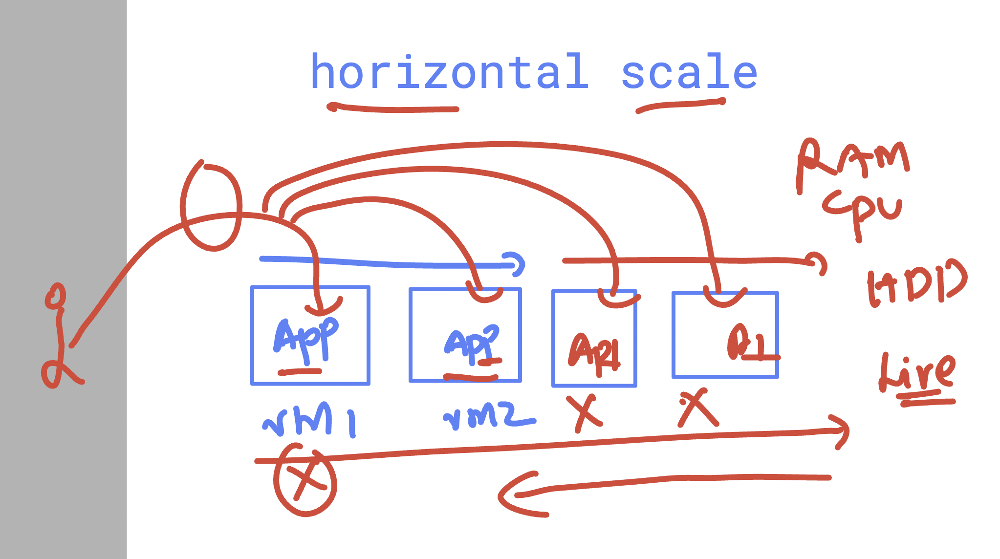
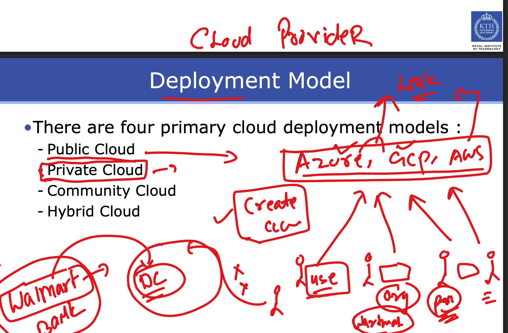
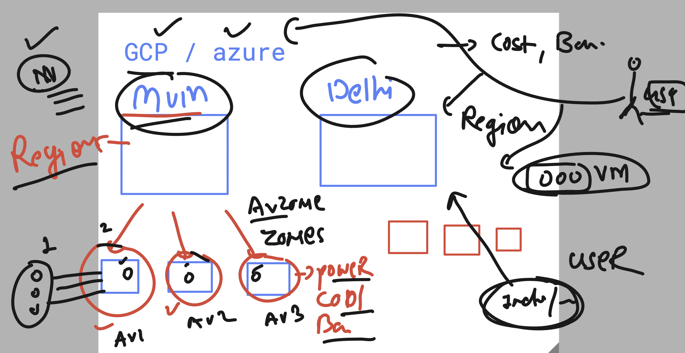
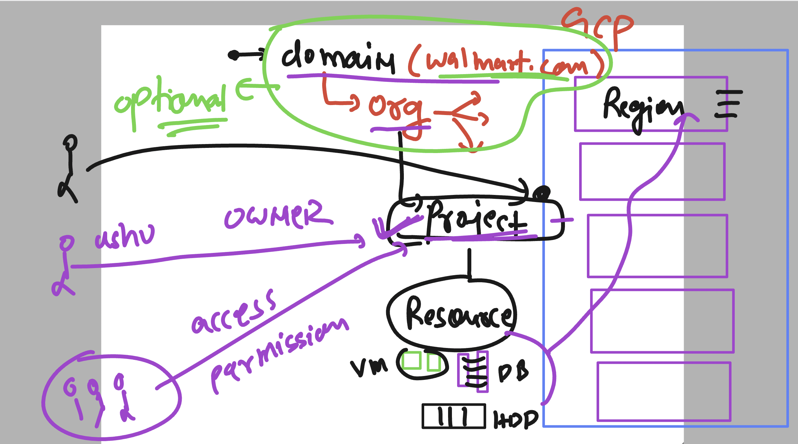
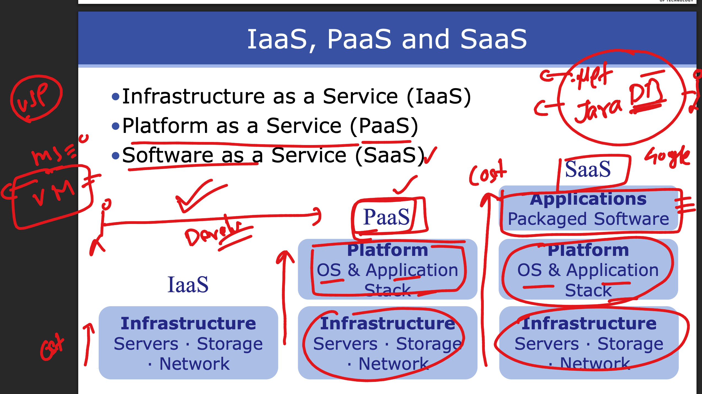
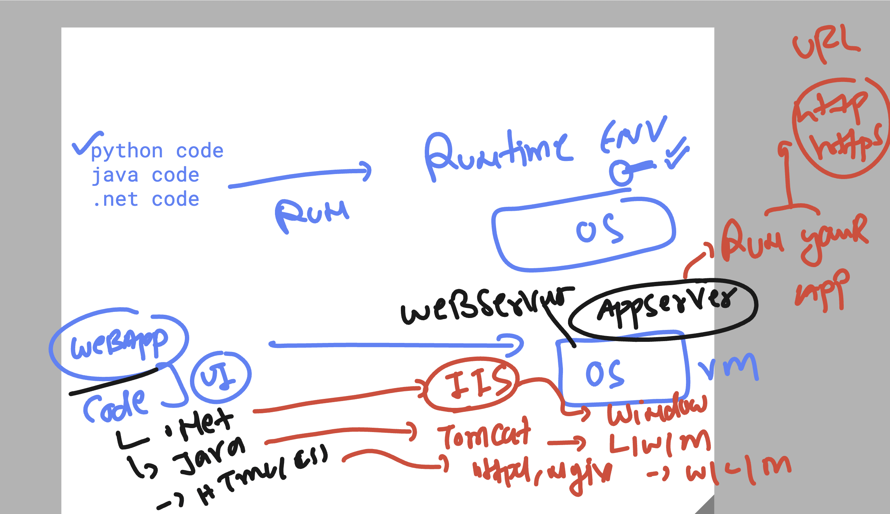

# walmart_TPM_CLOUD_22ndsept2025

### In app infra  Rent vs purchase

## Cloud computing platform understanding 

### vertical vs horizontal scale in cloud computing model 

### horizontal scale 

## Cloud Deployment models 

### Region and avzone in cloud 

## GCP understanding 

## any cloud will offer as a service model 

### app/web server in hosting webapps

