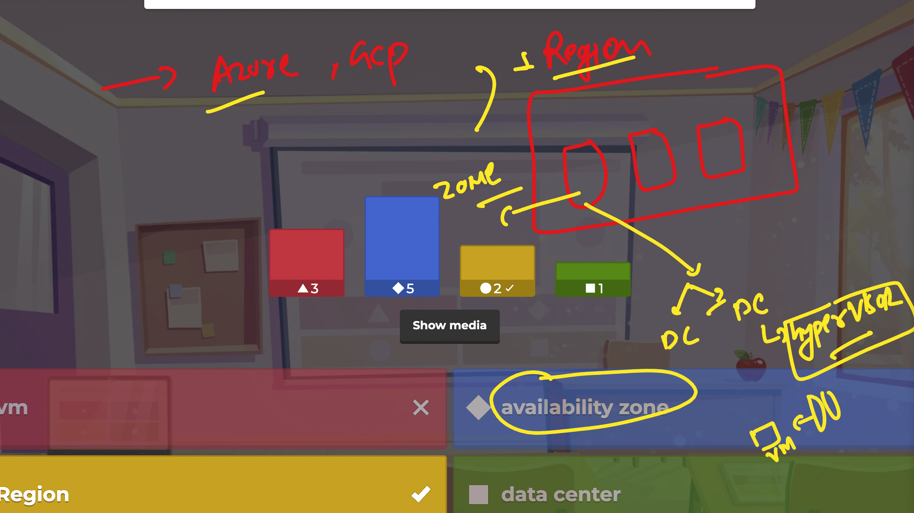
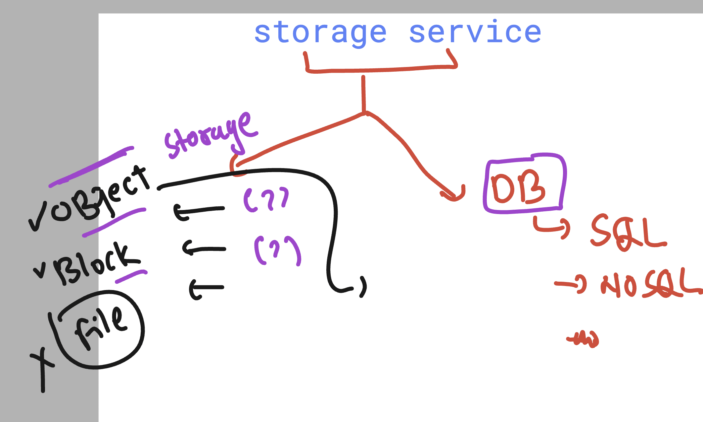
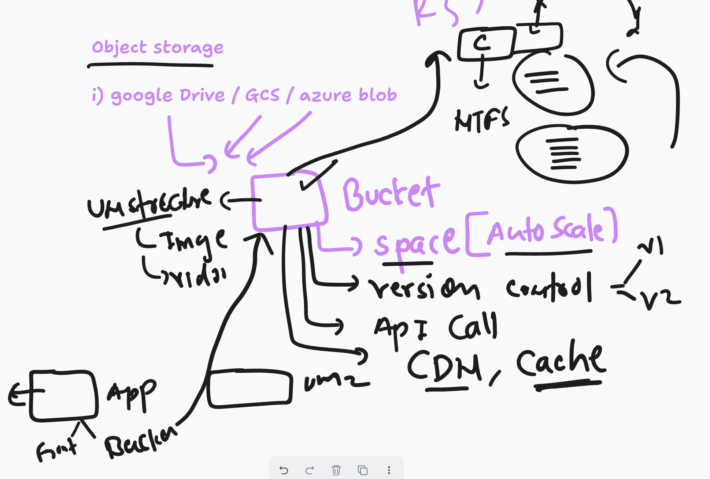
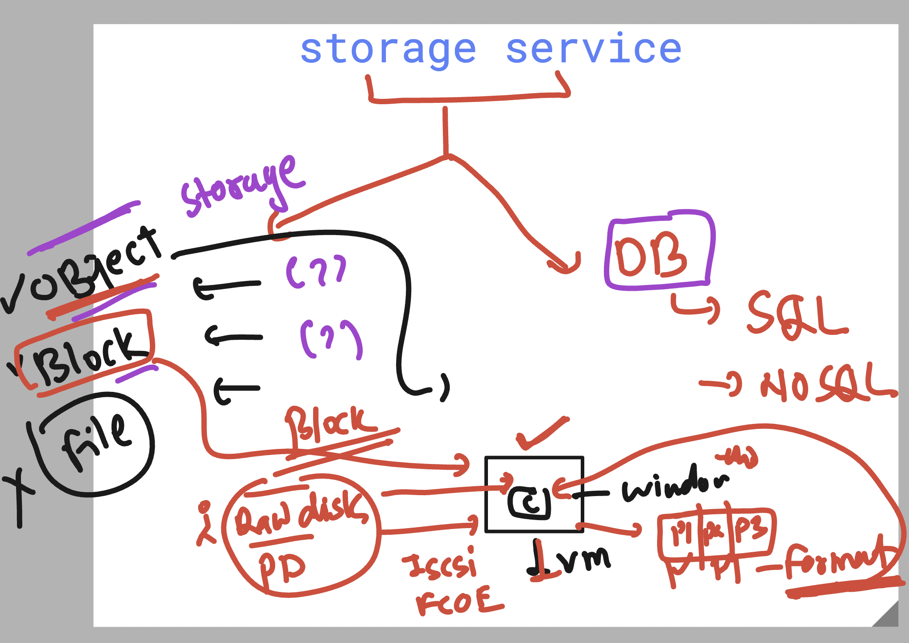
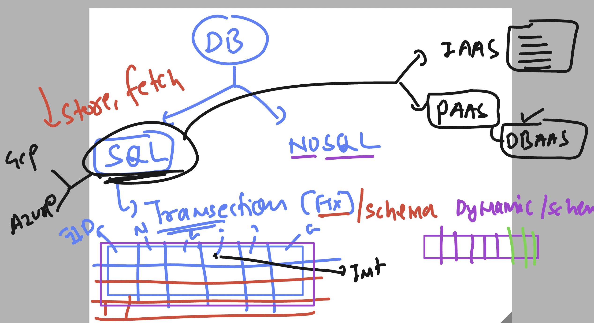
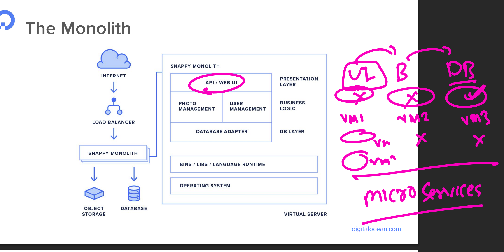
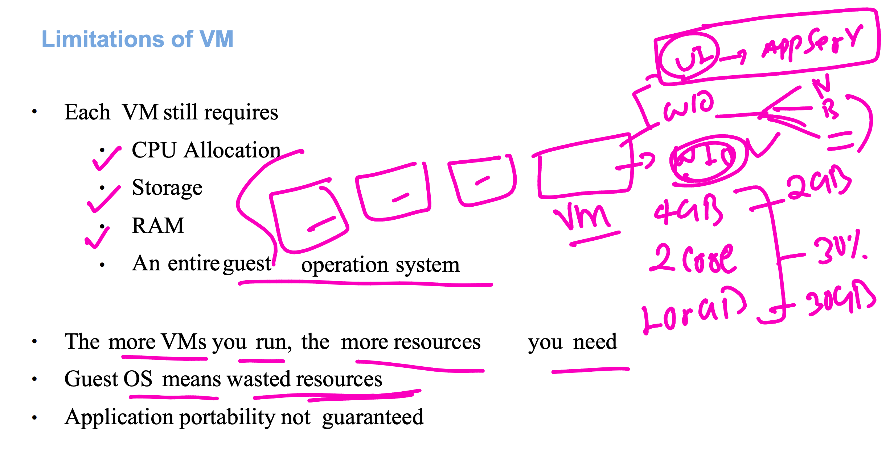
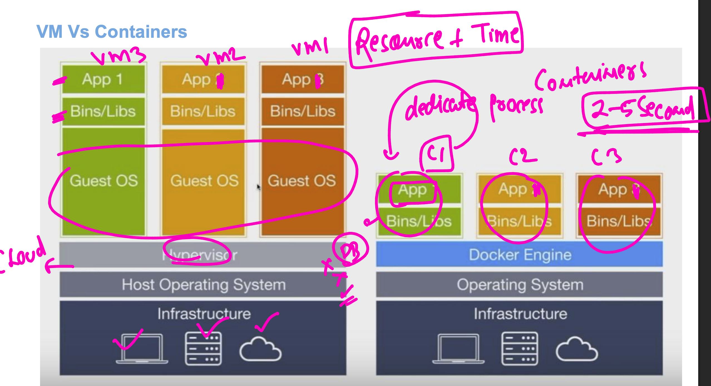
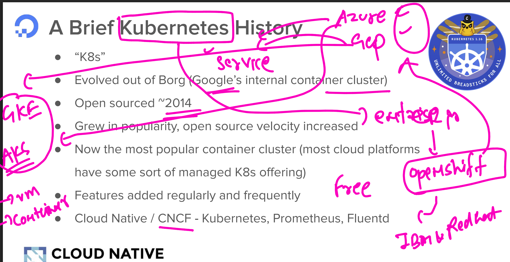
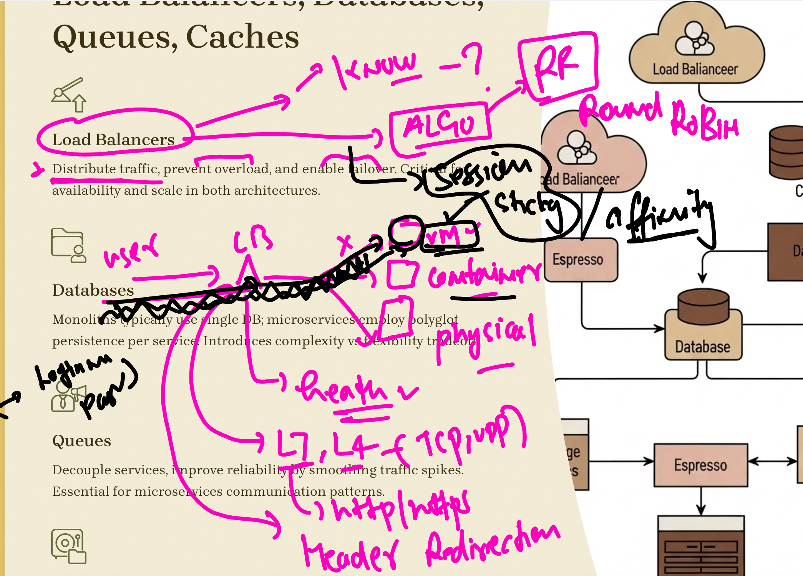

# walmart_TPM_CLOUD_22ndsept2025

### public cloud order system 

[app_engine](app_engine.md)

## storage service understanding in cloud 

### object storage 

## more info about block storage in cloud 

## SQL vs NOSQL  in cloud 

## Monolith to microservices 

## in microservices scaling horizontal to use a VM is a problem 

## for Microservices deployment of each component gonna happen with containers

## container orchestration engine 

## some info about LB 

