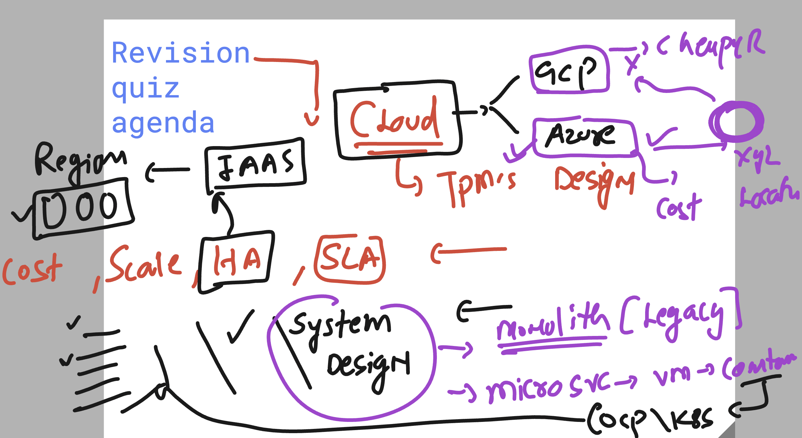
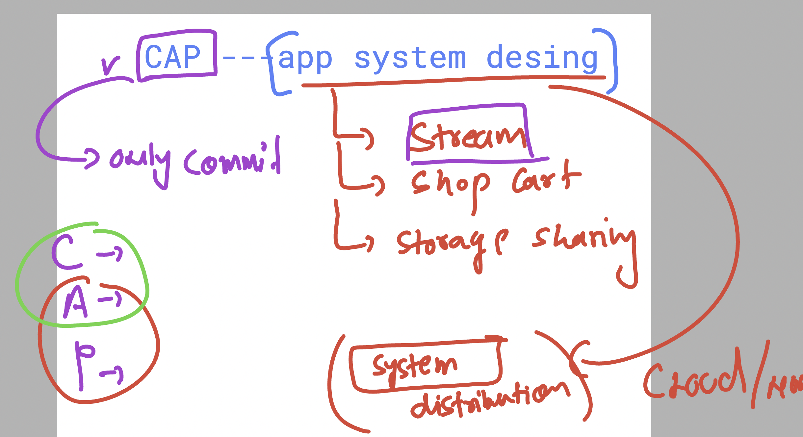

# walmart_TPM_CLOUD_22ndsept2025

### basic revision 

### Understanding of CAP 

## click below 

[cap](cap.md)

### apigw vs LB 

| Feature | Load Balancer | API Gateway |
|---------|---------------|-------------|
| Main Role | Distributes traffic | Manages and secures APIs |
| Focus | Availability & Scalability | Security, Routing, Governance |
| Knows About APIs? | ❌ No (only routes to servers) | ✅ Yes (understands API endpoints, versions) |
| Handles Auth? | ❌ No | ✅ Yes |
| Protocol Support | L4 (TCP/UDP), L7 (HTTP/HTTPS) | L7 only (HTTP/HTTPS, gRPC) |
| Use Case | Spread traffic among app servers | Control access, apply policies, version APIs |
| Azure Service | Azure Load Balancer / App Gateway | Azure API Management |
| GCP Service | Cloud Load Balancing | Apigee / API Gateway |