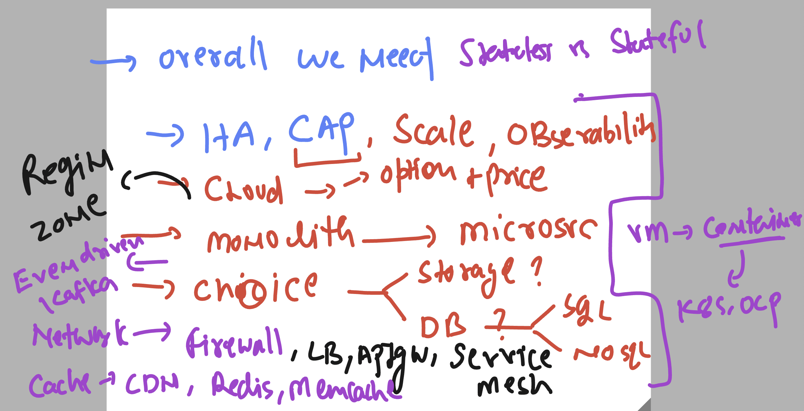
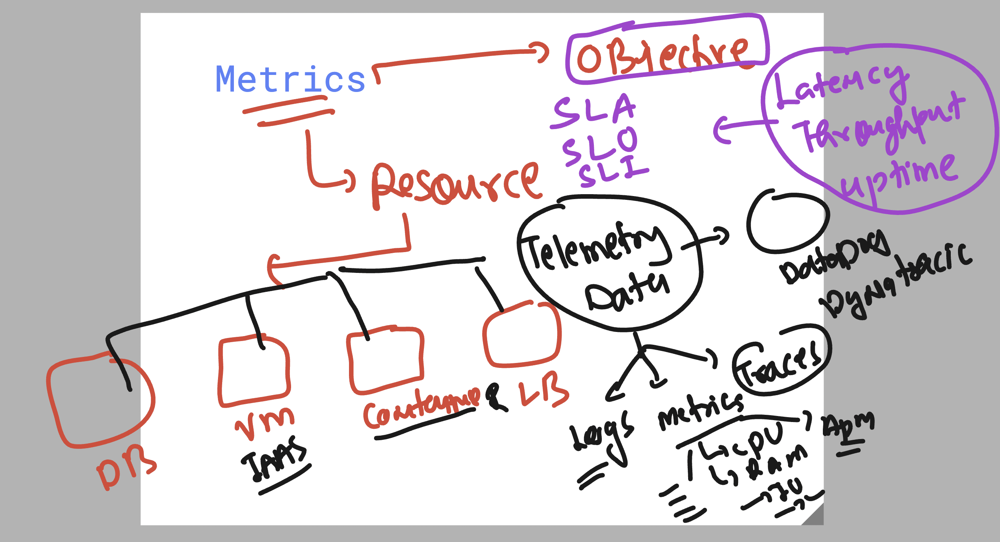
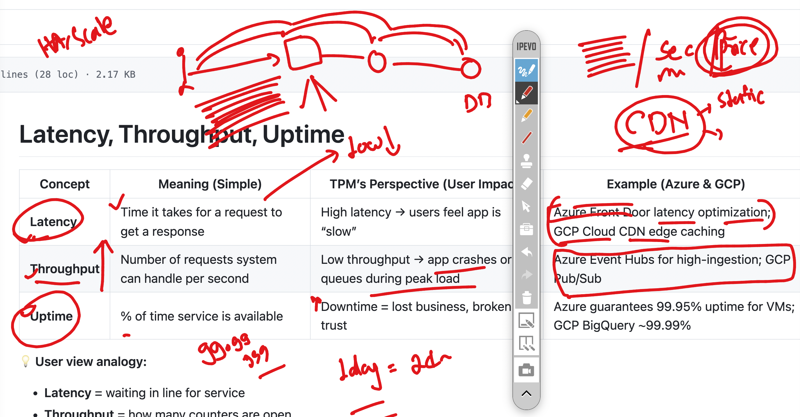

# walmart_TPM_CLOUD_22ndsept2025

### Revision in overall 

### Metrics (resources & objective )

## more understanding about options of object 

## some import points to understand

# Latency, Throughput, Uptime

| **Concept**  | **Meaning (Simple)**                          | **TPM’s Perspective (User Impact)**        | **Example (Azure & GCP)**                                  |
|--------------|-----------------------------------------------|--------------------------------------------|------------------------------------------------------------|
| **Latency**  | Time it takes for a request to get a response | High latency → users feel app is “slow”    | Azure Front Door latency optimization; GCP Cloud CDN edge caching |
| **Throughput** | Number of requests system can handle per second | Low throughput → app crashes or queues during peak load | Azure Event Hubs for high-ingestion; GCP Pub/Sub            |
| **Uptime**   | % of time service is available                | Downtime = lost business, broken trust     | Azure guarantees 99.95% uptime for VMs; GCP BigQuery ~99.99% |

💡 **User view analogy:**
- **Latency** = waiting in line for service  
- **Throughput** = how many counters are open  
- **Uptime** = whether the shop is even open  

---

# SLAs, SLOs, SLIs

These are often mixed up, but think of them as **Promise → Goal → Measurement.**

| **Term** | **Meaning** | **Example in Azure / GCP** | **TPM Relevance** |
|----------|-------------|-----------------------------|-------------------|
| **SLA (Service Level Agreement)** | Formal contract from provider to customer | Azure SQL DB: 99.99% SLA | TPM ensures product meets external commitments |
| **SLO (Service Level Objective)** | Internal target set by the team | “We aim for <200ms latency 95% of the time” | Helps TPM guide team priorities & focus |
| **SLI (Service Level Indicator)** | Actual metric measured | “This week, average latency was 180ms” | TPM tracks SLIs to ensure SLOs are met |

💡 **Analogy for TPMs:**
- **SLA** = Promise to the customer  
- **SLO** = Team’s performance goal  
- **SLI** = Speedometer (real-time truth)  

---

# ✅ What TPMs should monitor:
- Latency spikes (**signals bad user experience**)  
- Throughput drops (**signals scaling issues**)  
- Uptime dips (**signals availability risk**)  
- SLI vs SLO gaps (**signals commitments at risk**)  

### Understanding of security & its compliance 

[security](security_compliance.md)

### project final 

# Capstone Project: TPMs Design & Present a System

## Assignment

Teams will design a system (example options: **ridesharing backend** or **video streaming platform**). The following aspects must be addressed:

- **Cost vs. performance vs. maintainability**
- **Build vs. buy considerations**
- **Managing dependencies**
- **System and architecture diagrams**
- **PRD (Product Requirement Document) outline**

## Tools for Reference

- Whiteboard or Lucidchart for diagrams
- GCP/Azure consoles for pricing and service comparisons

## Peer Review

- Each team presents their solution
- Other teams and instructor provide structured feedback

###

# Communication Role-Play Scenarios for TPMs

---

## TPM → Engineer

- **Focus:** Technical feasibility  
- **What to emphasize:** Clarity on requirements, dependencies, and edge cases.  
- **Avoid:** Vague business jargon.  
- **Example role-play:** TPM explains a feature request; engineer pushes back on scalability concerns.

---

## TPM → Architect

- **Focus:** Trade-offs + alignment  
- **What to emphasize:** Performance, security, scalability, and integration with existing systems.  
- **Avoid:** Getting into micro-level implementation details.  
- **Example role-play:** TPM asks architect about whether to use a managed DB vs. self-hosted cluster.

---

## TPM → Leadership

- **Focus:** Business impact  
- **What to emphasize:** Cost, timeline, risk, customer experience.  
- **Avoid:** Overwhelming with low-level tech detail.  
- **Example role-play:** TPM presents why adopting serverless reduces infra costs and accelerates delivery.